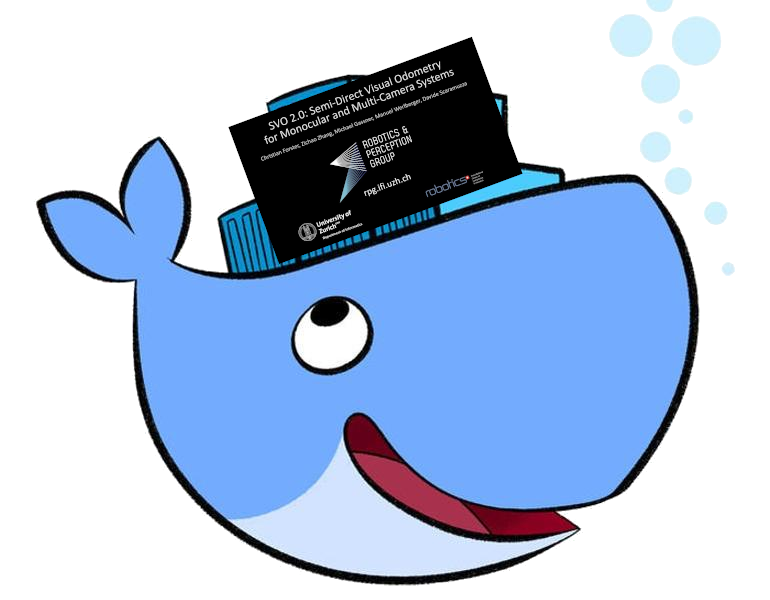

# svo_ros Docker Template
A Docker container for running the [Semi-Direct Visual Odometry 2.0 (SVO)](http://rpg.ifi.uzh.ch/svo2.html) visual odometry algorithm with ROS!


## Introduction



As amazing as the [SVO ROS example package](https://github.com/uzh-rpg/rpg_svo_example) is, even detailing installation steps, it's hard to get it set up on some systems, especially since the supported systems are less widely used or straight up deprecated nowadays.

So why not use Docker to help preserve the environments and allow SVO to run on all sorts of systems and environments with minimal overhead?

Cheers!


## Pre-Requisites

- Docker :whale:
  - You can find a [tutorial](https://github.com/methylDragon/docker-reference/blob/master/01%20Docker%20Crash%20Course.md) here
  - And an [installation guide](https://github.com/methylDragon/docker-reference/blob/master/01%20Docker%20Crash%20Course.md#2.2) too!
- The SVO [Binaries](http://rpg.ifi.uzh.ch/svo2.html)
  - Specifically the one for x86_64 Ubuntu 16.04
  - (Named svo_binaries_1604_kinetic)
  - I'd include it as a wget call in the Dockerfile script, but I don't want to break any licenses


## Setup

### Pre-Setup

Once you've downloaded your binaries, do place them in the root of this repository.

So your file tree should look something like this:

```
svo_ros_docker
├── Dockerfile
├── README.md
├── svo_entrypoint.sh
├── svo_binaries_1604_kinetic/
   └── rpg_svo_example/
   └── svo_install_ws/
   └── ...
```


### Build The Image!

```shell
docker build -t ros:svo .
```


## Validation

### Run the Demo!


We'll need to download the [demo bag file](http://rpg.ifi.uzh.ch/svo2/svo_test_short.bag). Save it somewhere accessible on your host computer.

**On Host Computer**

We didn't enable GUI in the Docker container because some machines (typically with NVIDIA GPUs) can't run GUIs without bloating the container! Thankfully we can run visualisations on our host machine instead.

```shell
# In one terminal, ensure your ROS_MASTER_URI is not on localhost,
# Then start a ROS master first!
export ROS_MASTER_URI=http://127.0.0.1:11311
roscore

# Then in another terminal, navigate to the rpg_svo_example on your host, and run RVIZ
export ROS_MASTER_URI=http://127.0.0.1:11311
cd <svo_ros_docker_repo_dir>/svo_binaries_1604_kinetic/rpg_svo_example/svo_ros
rviz -d rviz_config.rviz
```

**In SVO_ROS Docker Container**

```shell
# Spin up the Docker container and make it ephemeral
# Remember to set network to host! We'll also just do local for IPs
docker run -it \
           --rm \
           --net=host \
           -e ROS_IP=127.0.0.1 \
           ros:svo

# Once inside the Docker container we'll source the workspace and run the demo!
source svo_ws/devel/setup.bash
roslaunch svo_ros run_from_topic.launch cam_name:=svo_test_pinhole
```

**Play Bag!**

```shell
# Finally, in your host machine, play the bag file
export ROS_MASTER_URI=http://127.0.0.1:11311
export ROS_IP=127.0.0.1

cd <bagfile_directory>
rosbag play svo_test_short.bag
```


## Deploying svo_ros from the Docker Container

If you actually want to use the SVO_ROS Docker container in a deployment context, just properly set your `ROS_MASTER_URI` and `ROS_IP` to whatever you need.

There are also some things to take note of:

- Because using the `svo_ros` package in a deployment context will require you to have certain calibration files handy, we'll need to create a persisting container. Run the `docker run` command **once**.

- While you can do crazy stuff like mount volumes and stuff for your convenience, I won't be going through that here

  - Instead, if you want to make your own customised SVO pipeline, you will need to:

    > 1. Get your own calibration camchain made from [Kalibr](https://github.com/ethz-asl/kalibr) and put it into the container's `/home/svo_ws/src/rpg_svo_example/svo_ros/calib`.
    >
    >    ```shell
    >    # To copy files into a container
    >    docker cp <host_file_path> <container_name>:<container_file_dest_path>
    >    ```
    >
    > 2. Do the same thing but for the param file in `/home/svo_ws/src/rpg_svo_example/svo_ros/param`.
    >
    > 3. Edit the `run_from_topic.launch` launchfile to accept your own camera's topics, and your own special param file, or create your own launchfile based off of it for yourself.

  - If you're really lazy to keep copying files back and forth, you can also just edit the files you've copied in directly. I made sure the container has `nano`.

  - Or if you want to be really efficient, you can just mount a volume in the `docker run` command and point the launchfile to those volumes. Then you can just edit the files on your host, and they should be reflected in the container.

```shell
# Create the container
# In this case, we name it svo_rawr
docker run -it \
           --net=host \
           -e ROS_MASTER_URI=http://<YOUR_MASTER_URI_HERE>:11311 \
           -e ROS_IP=<YOUR_HOST_IP> \
           --name=svo_rawr \
           ros:svo
           
docker run -it \
           --net=host \
           -e ROS_MASTER_URI=http://127.0.0.1:11311 \
           -e ROS_IP=127.0.0.1 \
           --name=svo_rawr \
           ros:svo
           
# For subsequent runs, use docker exec after starting the container
docker start svo_rawr
docker exec -it svo_rawr bash

# If you need to change the IPs for some reason, inside the container, re-export them
# Or, alternatively, just remake the container
export ROS_MASTER_URI=http://<new_master_uri>:11311
export ROS_IP=<YOUR_HOST_IP>

# After which you can run it as above
source svo_ws/devel/setup.bash
roslaunch svo_ros run_from_topic.launch cam_name:=<your_cam_calib_file_name>
```


## Notes

### Overlay Workspace Naming

The overlay workspace is called `/home/svo_ws` instead of `svo_install_overlay_ws` like specified in the installation guide for SVO.


### Running with Specified Hostnames, Master URIs, and IP

Simply pass in the relevant environment variables using the `-e` flag!


```shell
# For example, for a custom ROS_MASTER_URI:
docker run -it --rm -e ROS_MASTER_URI=RAWR ros:svo
echo $ROS_MASTER_URI
```


```
                            .     .
                         .  |\-^-/|  .    
                        /| } O.=.O { |\
```

---

 [-1567671281238.png)](https://www.buymeacoffee.com/methylDragon)

[Or leave a tip! ヾ(°∇°*)](https://www.paypal.me/methylDragon)

